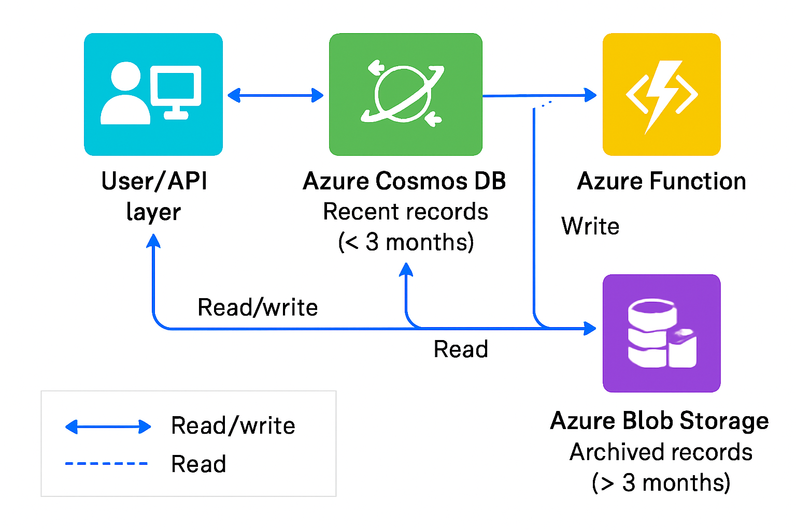

# Azure Cost Optimization Challenge

## Assignment Prompt

Cost Optimization Challenge: Managing Billing Records in Azure Serverless Architecture

We have a serverless architecture in Azure, where one of our services stores billing records in Azure Cosmos DB. The system is read-heavy, but records older than three months are rarely accessed.
Over the past few years, the database size has significantly grown, leading to increased costs. We need an efficient way to reduce costs while maintaining data availability.

### Current System Constraints

- **Record Size:** Each billing record can be as large as 300 KB.
- **Total Records:** The database currently holds over 2 million records.
- **Access Latency:** When an old record is requested, it should still be served, with a response time in the order of seconds.

### Solution Requirements

Propose a detailed solution to optimize costs while ensuring:
- **Simplicity & Ease of Implementation:** The solution should be straightforward to deploy and maintain.
- **No Data Loss & No Downtime:** The transition should be seamless, without losing any records or requiring service downtime.
- **No Changes to API Contracts:** The existing read/write APIs for billing records must remain unchanged.

### Bonus Points

- Include an architecture diagram illustrating your proposed solution.
- Provide pseudocode, commands, or scripts for implementing core logic (such as data archival, retrieval, and cost optimization strategies).
- Please share the solution in a Github repo. If using chatGPT or other LLMs to solve, please share the conversation.

---

## My Solution

### 1. Solution Overview

- **Hot data (<3 months old):** Kept in Azure Cosmos DB for fast access.
- **Cold data (>3 months old):** Migrate to Azure Blob Storage, reducing storage costs. Old records are still available, with a slightly higher access time (seconds, not milliseconds).
- **API Behavior:** Existing APIs remain unchanged. Logic is added so that if a user requests an old record, it is fetched from Blob Storage if not found in Cosmos DB.
- **No Data Loss, No Downtime:** Data migrations are validated before deleting from Cosmos DB.

### 2. Architecture Diagram



### 3. Implementation (Pseudocode)

```python
def archive_old_records():
    for record in cosmos_db.get_records_older_than(months=3):
        blob_storage.save(record.id, record.data)
        cosmos_db.mark_record_as_archived(record.id)
        # Delete or remove large data after ensuring backup exists

def get_billing_record(record_id):
    record = cosmos_db.get(record_id)
    if record and not record.archived:
        return record.data
    elif record and record.archived:
        return blob_storage.get(record_id)
    else:
        return None

### 4. Benefits

- **Cost Reduction:** Cosmos DB storage cost reduced; Blob Storage cheaper for infrequent records.
- **No Downtime:** Operations are atomic; only delete after migration is verified.
- **No Data Loss:** Migration only after records confirmed in blob.
- **Simple Rollback:** Archiving is easy to reverse for frequently-accessed cold data.

### 5. Issues & Solutions

- **Migration Failures:** Log and retry; never delete unless blob is verified.
- **Blob Latency:** Cold records are slower; allow rehydration for frequently accessed records.
- **Security:** Lock Blob and DB with IAM and encryption.
- **Monitoring:** Alerts and logs for migration, latency, and unexpected errors.

---


